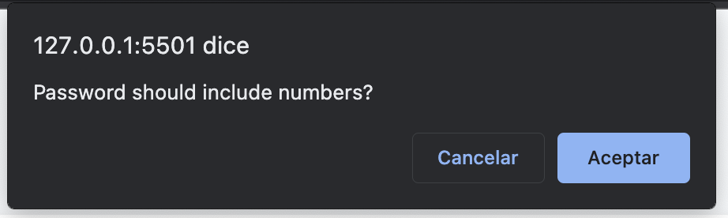
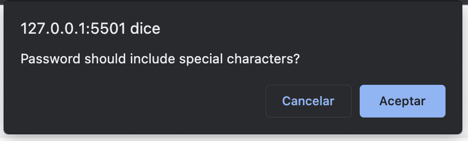

This is a page when you can create a safe password, based in this options:

1. The lenght of the password should be between 8 and 128 characters.
    

2. You can select the use of lower case letters.
    

3. You can select the use of upper case letters.
    

4. You can select the use of numbers.
    

5. You can select the use of special characters.
        

Once the password is created is visible in the page.

